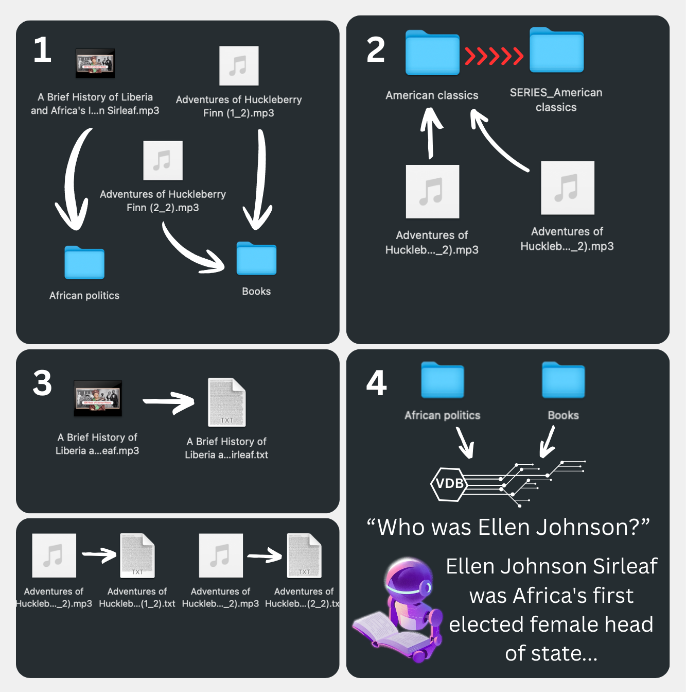

# MP3 Transcriber & Organizer

A Jupyter notebook that automatically organizes and transcribes your MP3 files using a local LLM for categorization and Whisper for transcription. The category structure is inferred automatically from your existing folder layout, so it works with your folder structure already set up. Whisper will skip files that already have a companion `.txt` file, so re-running is safe.

## What it does

Takes a messy folder of MP3s and:
- Sorts them into categories using a local Mistral model (via Ollama)
- Transcribes them to text using OpenAI Whisper
- Optionally loads everything into a local PostgreSQL database for querying
- Lets you RAG over your transcripts using LlamaIndex + Claude

## Requirements

- [Ollama](https://ollama.ai) running locally with `mistral-small3.2:24b` pulled
- Docker (for the PostgreSQL container) (easiest install: Docker Desktop or Rancher Desktop)
- Python 3.10+
- An Anthropic API key if you want to use the RAG query part
- Windows: Installed ffmpeg (choco install ffmpeg)

## Quickstart

./start_mac_linux.sh or ./start_windows.bat

and then click trough the notebook. Set your MP3 folder path at the beginning.
